<style>
img {
  max-width: 100%;
  height: auto;
  display: block;
  margin: 1em auto;
  border-radius: 8px;
  box-shadow: 0 2px 8px rgba(0,0,0,0.1);
}

.container {
  max-width: 1200px;
  margin: 0 auto;
}


/* Code styling - Terminal look */
pre {
  background-color: #1e1e1e !important;
  color: #ffffff !important;
  border: 2px solid #333 !important;
  border-radius: 8px !important;
  padding: 20px !important;
  margin: 20px 0 !important;
  overflow-x: auto !important;
  max-width: 100% !important;
  font-family: 'Courier New', Consolas, Monaco, monospace !important;
  font-size: 14px !important;
  line-height: 1.4 !important;
  box-shadow: 0 4px 12px rgba(0,0,0,0.3) !important;
}

pre code {
  background-color: transparent !important;
  color: #ffffff !important;
  padding: 0 !important;
  border: none !important;
  word-wrap: break-word !important;
  overflow-wrap: break-word !important;
}

/* Inline code styling */
code {
  background-color: #2d2d2d !important;
  color: #ffffff !important;
  padding: 2px 6px !important;
  border-radius: 4px !important;
  font-family: 'Courier New', Consolas, Monaco, monospace !important;
  font-size: 13px !important;
  word-wrap: break-word;
  overflow-wrap: break-word;
}

/* Syntax highlighting for Go code */
pre code .keyword { color: #569cd6 !important; }
pre code .string { color: #ce9178 !important; }
pre code .comment { color: #6a9955 !important; }
pre code .function { color: #dcdcaa !important; }
pre code .type { color: #4ec9b0 !important; }

/* Header hierarchy styles */
h1 { font-size: 2.5rem !important; }
h2 { font-size: 2.0rem !important; }
h3 { font-size: 1.5rem !important; }
h4 { font-size: 1.25rem !important; }
h5 { font-size: 1.1rem !important; }
h6 { font-size: 1.0rem !important; }

@media (max-width: 768px) {
  img {
    max-width: 95%;
  }
  
  pre {
    font-size: 14px;
  }
  
}
</style>

# Inside Message Broker

## Introduction

In the world of multi-tier distributed systems, there is a critical need for message queues. They solve fundamental communication problems between services, providing reliable asynchronous data transmission and creating the foundation for scalable, fault-tolerant architectures.

## Problems Solved by Message Queues

### Asynchronous Communication and Service Independence

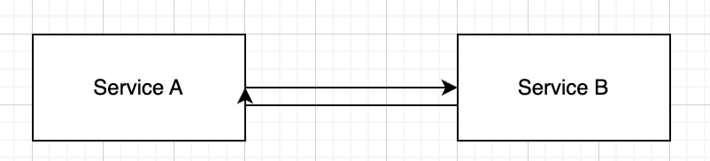

- **Services can operate independently in time**
- **Senders don't wait for receivers to become available**
- **Decouples service lifecycles and deployment schedules**

Instead of making sequential calls to multiple microservices, message queues enable rapid message delivery to several microservices simultaneously. A single message can be published once and consumed by multiple services, dramatically reducing latency and eliminating the complexity of coordinating synchronous calls across distributed systems.

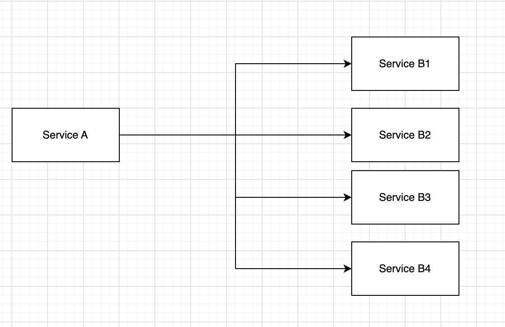

**Instead of complex synchronous interactions between multiple services, we can simplify with a queue:**

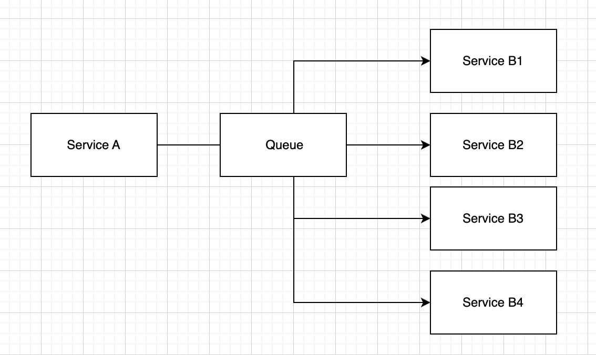

**Improved Fault Tolerance:**
- When a receiver temporarily crashes, messages are stored in the queue and processed later
- Reduces risk of data loss during service outages
- Provides graceful degradation under failure conditions

**Scalability:**
- Easy to add more consumers (workers) to process messages faster
- Queue distributes load between multiple consumers
- Horizontal scaling without architectural changes

**Load Buffering:**
- When incoming request flow is very large, the queue temporarily "smooths" the load
- Protects the system from overload situations
- Acts as a shock absorber for traffic spikes

**Reliable Data Transmission and Logging:**
- **Messages are not lost (or rarely lost, depending on configuration)**
- **Can implement guaranteed delivery ("at least once", "exactly once")**
- **Provides audit trail and replay capabilities**

### Why Not Just Use Simple Programming Language Queues?

You might think: "Why not just use a simple queue from a programming language where first-in-first-out (FIFO) works?" Indeed, we could use basic data structures like queues from standard libraries:
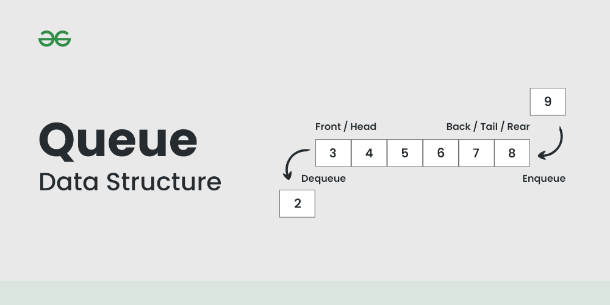
```go
type SimpleQueue struct {
    items []Message
    mutex sync.Mutex
}

func (q *SimpleQueue) Enqueue(msg Message) {
q.mutex.Lock()
defer q.mutex.Unlock()
q.items = append(q.items, msg)
}

func (q *SimpleQueue) Dequeue() (Message, bool) {
q.mutex.Lock()
defer q.mutex.Unlock()

    if len(q.items) == 0 {
        return Message{}, false
    }
    
    msg := q.items[0]
    q.items = q.items[1:]
    return msg, true
}
```
However, this approach has a critical problem: **when we dequeue a message, we no longer store it anywhere**. If we retrieve a message and our consumer becomes unavailable (crashes, network issues, etc.), we lose that data permanently. The message is gone from the queue but never processed.

### What Makes Message Brokers Production-Ready

Message brokers are sophisticated distributed systems designed to solve enterprise-grade messaging challenges. They consist of several core components and differ significantly in their architecture and trade-offs:

#### 1. Core Components of Message Brokers

All modern message brokers share these fundamental building blocks:

**1. Storage Engine**
- **Persistent storage**: Messages stored on disk for durability (vs in-memory volatility)
- **Log-based storage**: Append-only logs for high throughput (Kafka, Pulsar)
- **Index structures**: Fast message lookup and routing (RabbitMQ exchanges, Kafka offsets)

**2. Acknowledgment & Delivery Guarantees**
- **At-most-once**: Fast but may lose messages
- **At-least-once**: Reliable but may duplicate messages  
- **Exactly-once**: Strongest guarantee but highest latency

**3. Consumer Position Tracking**
- **Offset management**: Track consumer progress through message stream
- **Resumability**: Consumers can restart from last processed position
- **Multiple consumption models**: Push vs Pull, competing consumers vs pub/sub

**4. Replication & High Availability**
- **Multi-node clusters**: Distribute load and provide fault tolerance
- **Leader/follower replication**: Ensure no data loss during failures
- **Automatic failover**: Seamless leader election when nodes fail

#### 2. Message Broker Architecture Patterns

**Log-Based Architecture (Kafka, Pulsar)**
```
Topic → Multiple Partitions → Distributed across brokers
Messages stored in immutable log segments
Consumers track offset position
```

**Exchange-Based Architecture (RabbitMQ, ActiveMQ)**
```
Exchange → Routing Rules → Queues → Consumers
Messages routed through sophisticated exchange patterns
Queues can be persistent or transient
```

**Cloud-Native Architecture (AWS SQS/SNS, Google Pub/Sub)**
```
Managed service → Multiple availability zones → Auto-scaling
Built-in durability and scaling handled by cloud provider
Event-driven triggers and integrations
```

#### 3. Different Message Brokers Comparison

Various message brokers exist, each with different trade-offs:

- **Kafka**: High-throughput, log-based, designed for stream processing
- **RabbitMQ**: Traditional messaging patterns, complex routing, lower latency
- **AWS SQS/SNS**: Managed services, simple integration, limited throughput
- **NATS**: Ultra-low latency, lightweight, good for microservices

### CAP Theorem and Message Brokers

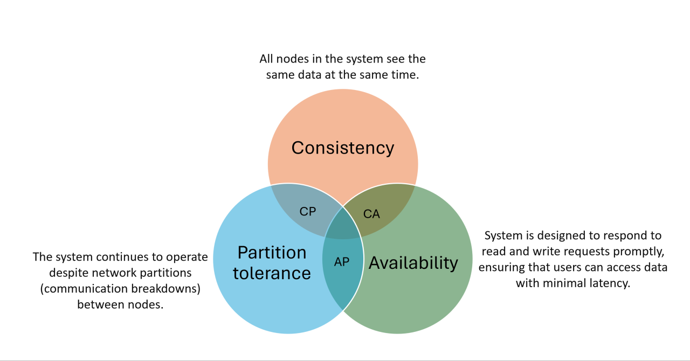

#### How CAP Theorem Relates to Message Brokers

Message brokers (Kafka, RabbitMQ, NATS, Pulsar, etc.) are distributed systems and must comply with the CAP theorem. Different brokers make different trade-offs between Consistency, Availability, and Partition tolerance.

**Examples:**

**Apache Kafka**
- Chooses AP (Availability + Partition tolerance)
- During network failures, continues to operate
- May temporarily lose consistency (different nodes may see different states)
- Later data "catches up" and synchronizes

**RabbitMQ (in cluster mode)**
- Closer to CA (Consistency + Availability) while network is stable
- During partition, may "freeze" or lose some messages to maintain consistency

**NATS JetStream**
- Usually balances between AP and CP, depending on configuration
- Can choose priority (availability or strict consistency) based on use case

## Let's Look Inside: How Apache Kafka Works

### Brokers: The Foundation

The Kafka cluster consists of brokers. You can think of the system as a data center and servers in it. When first getting acquainted, think of a Kafka broker as a computer: it's a process in the operating system with access to its local disk.

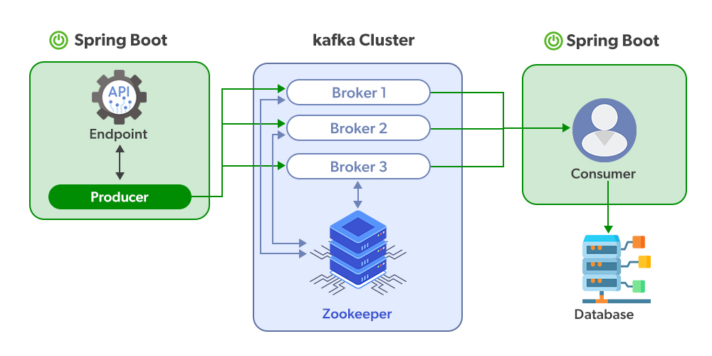

All brokers are connected to each other by a network and act together, forming a single cluster. When we say that producers write events to a Kafka cluster, we mean that they work with brokers in it.

By the way, in a cloud environment, the cluster doesn't necessarily run on dedicated servers - these can be virtual machines or containers in Kubernetes.

### Topics and Partitions

#### Topics: Logical Organization

A topic is a **logical division** of message categories into groups. For example, events by order statuses, partner coordinates, route sheets, and so on.

The key word here is **logical**. Topics are conceptual containers that organize related messages together. We create topics for events of a common group and try not to mix them with each other. For example, partner coordinates should not be in the same topic as order statuses, and updated order statuses should not be stored mixed with user registration updates.

**Topics are logical splits** - they define what kind of data goes where, but they don't determine how the data is physically stored.
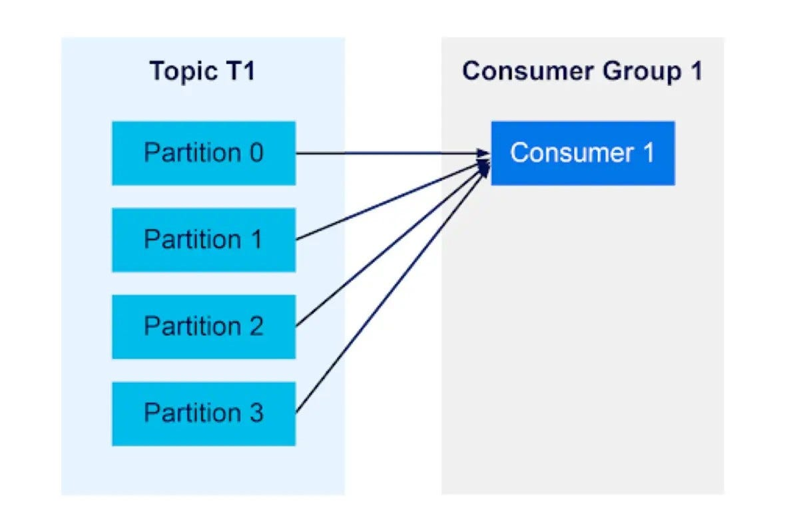

It's convenient to think of a topic as a log - you write an event to the end and don't destroy the chain of old events in the process. General logic:

- One producer can write to one or more topics
- One consumer can read one or more topics
- One or more producers can write to one topic
- One or more consumers can read from one topic

Theoretically, there are no restrictions on the number of these topics, but practically this is limited by the number of partitions.
#### Partitions: Physical Splitting of Data
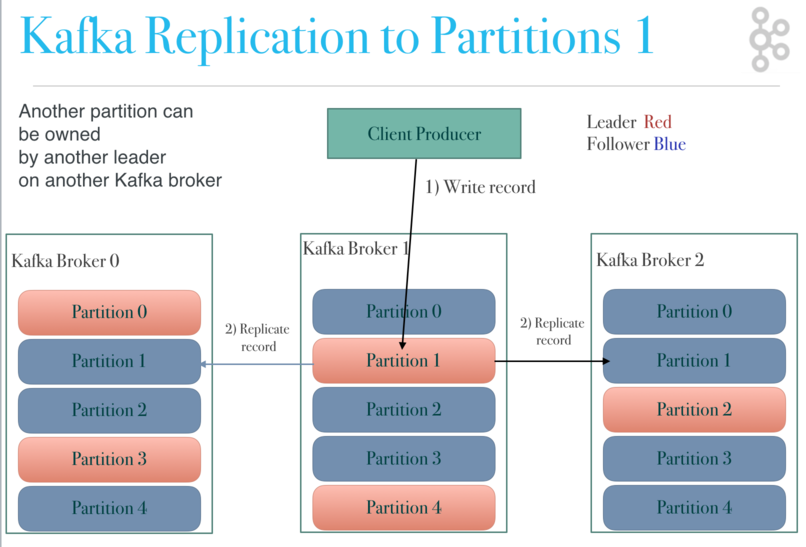

While topics provide logical organization, **partitions handle the physical splitting of data**. There are no restrictions on the number of topics in a Kafka cluster, but there are limitations of the computer itself. It performs operations on the processor, input-output, and eventually hits its limit. We cannot increase the power and performance of machines indefinitely, so the topic data must be divided into physical parts.

In Kafka, these physical parts are called **partitions**. Each topic consists of one or more partitions, each of which can be placed on different brokers. This is how Kafka achieves horizontal scaling: you can create a topic, divide it into partitions, and place each partition on a separate broker.

**Key Relationship: Topics ⊃ Partitions**
- **Topics** = Logical containers (what data category)
- **Partitions** = Physical storage units (where and how data is stored)
- Topics are split into partitions for scalability and performance

Formally, a partition is a strictly ordered log of messages stored physically on disk. Each message in it is added to the end without the possibility of changing it in the future and somehow affecting already written messages. At the same time, the topic as a whole has no order, but the order of messages always exists within each individual partition.
#### Key-Based Partitioning and Scaling Limitations

Messages in Kafka have a structure that includes a key field:

```go
type Message struct {
    Topic       string            `json:"topic"`
    Partition   int32             `json:"partition,omitempty"`
    Key         []byte            `json:"key,omitempty"`
    Value       []byte            `json:"value"`
    Headers     map[string]string `json:"headers,omitempty"`
    Timestamp   int64             `json:"timestamp"`
    Offset      int64             `json:"offset,omitempty"`
}
```

**Important Rule: Messages with the same key always go to the same partition.** This is crucial for maintaining order within a key but creates scaling bottlenecks:

**Why same keys go to same partition:**
- Guarantees message ordering for each unique key
- Enables stateful processing where related events must be processed together
- Allows consumers to maintain state per key without coordination

**Scaling Limitation:**
When all messages have the same key (or a few hot keys), they all end up in the same partition, creating a bottleneck:

```
Topic: "user-events" 
Messages with key "user-123":
├── Message 1 → Partition 2 (based on hash of "user-123")
├── Message 2 → Partition 2 (same key = same partition)
├── Message 3 → Partition 2 (same key = same partition)
└── Message 4 → Partition 2 (same key = same partition)

Result: Only 1 partition handles all "user-123" traffic
Other partitions may be idle → Poor scaling
```

This means that even with 100 partitions, if all your messages have the same key, only 1 partition will be used, and you lose the benefits of horizontal scaling.

The partitions themselves are physically represented on disks as segments. These are separate files that can be created, rotated, or deleted according to the data aging settings in them. Usually you don't have to often remember about partition segments unless you administer the cluster, but it's important to remember the data storage model in Kafka topics.

```go
// Segment represents a physical file storing messages
type LogSegment struct {
    BaseOffset   int64     `json:"base_offset"`
    File         *os.File  `json:"-"`
    Size         int64     `json:"size"`
    MaxSize      int64     `json:"max_size"`
    CreatedAt    time.Time `json:"created_at"`
    MessageCount int       `json:"message_count"`
    IsActive     bool      `json:"is_active"`
}

// Partition contains multiple segments
type Partition struct {
    ID            int32          `json:"id"`
    Topic         string         `json:"topic"`
    Segments      []*LogSegment  `json:"segments"`
    ActiveSegment *LogSegment    `json:"active_segment"`
    HighWaterMark int64          `json:"high_water_mark"`
    LogStartOffset int64         `json:"log_start_offset"`
    Leader        BrokerID       `json:"leader"`
    Replicas      []BrokerID     `json:"replicas"`
    ISR           []BrokerID     `json:"isr"`
}

// Topic contains multiple partitions
type Topic struct {
    Name             string                `json:"name"`
    Partitions       map[int32]*Partition  `json:"partitions"`
    ReplicationFactor int                 `json:"replication_factor"`
    Config           TopicConfig           `json:"config"`
}

type TopicConfig struct {
    RetentionMs     int64  `json:"retention_ms"`
    SegmentMs       int64  `json:"segment_ms"`
    CleanupPolicy   string `json:"cleanup_policy"`
    CompressionType string `json:"compression_type"`
}
```

### Coordinator Service: Managing the Cluster
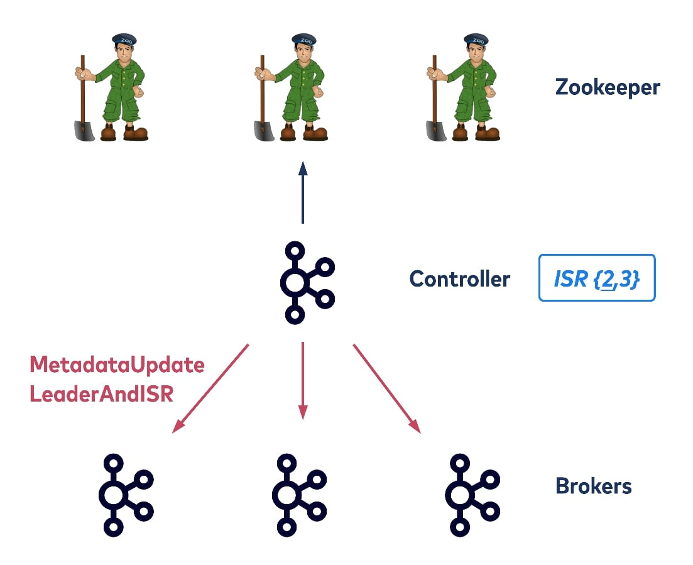
The coordinator acts as the brain of the Kafka cluster, managing metadata, broker orchestration, and service lifecycle. **In a traditional Kafka setup, this role is handled by Zookeeper** (or KRaft in newer versions), which maintains cluster state, broker registry, and topic metadata.

For more details about Kafka-Zookeeper architecture, see: [Kafka Architecture: Kafka Zookeeper](https://www.redpanda.com/guides/kafka-architecture-kafka-zookeeper)

**Our Custom Coordinator Implementation:**

Here's the code that emulates the work of our own coordinator, handling all cluster management responsibilities:

```go
type Coordinator struct {
    config       CoordinatorConfig
    brokers      map[BrokerID]*BrokerInfo
    topics       map[string]*TopicMetadata
    assignments  map[PartitionKey]BrokerID
    serviceManager *ServiceManager
    console      *ConsoleServer
    metadata     *MetadataStore
    mutex        sync.RWMutex
}

type ServiceManager struct {
    brokerProcesses  [5]*os.Process
    producerProcess  *os.Process
    consumerProcess  *os.Process
    coordinator      *Coordinator
}

type BrokerInfo struct {
    ID       BrokerID     `json:"id"`
    Host     string       `json:"host"`
    Port     int          `json:"port"`
    Status   BrokerStatus `json:"status"`
    LastSeen time.Time    `json:"last_seen"`
    Load     BrokerLoad   `json:"load"`
}

type BrokerStatus int

const (
    BrokerStarting BrokerStatus = iota
    BrokerOnline
    BrokerOffline
    BrokerDraining
)
```

#### Process Management

The coordinator automatically manages all services in the system:

```go
func (c *Coordinator) StartAll() error {
    // Start 5 brokers
    for i := 0; i < 5; i++ {
        port := 9092 + i
        brokerID := BrokerID(i)
        
        cmd := exec.Command("./bin/broker",
            "--id", fmt.Sprintf("%d", i),
            "--port", fmt.Sprintf("%d", port),
            "--coordinator", "localhost:8080")
        
        err := cmd.Start()
        if err != nil {
            return fmt.Errorf("failed to start broker %d: %w", i, err)
        }
        
        c.serviceManager.brokerProcesses[i] = cmd.Process
        
        // Register broker in coordinator
        c.registerBroker(BrokerInfo{
            ID:     brokerID,
            Host:   "localhost",
            Port:   port,
            Status: BrokerStarting,
        })
    }
    
    // Start producer service
    producerCmd := exec.Command("./bin/producer",
        "--port", "9093",
        "--coordinator", "localhost:8080")
    
    err := producerCmd.Start()
    if err != nil {
        return fmt.Errorf("failed to start producer: %w", err)
    }
    c.serviceManager.producerProcess = producerCmd.Process
    
    // Start consumer service
    consumerCmd := exec.Command("./bin/consumer",
        "--port", "9094",
        "--coordinator", "localhost:8080")
    
    err = consumerCmd.Start()
    if err != nil {
        return fmt.Errorf("failed to start consumer: %w", err)
    }
    c.serviceManager.consumerProcess = consumerCmd.Process
    
    return nil
}
```
#### Metadata Management

The coordinator tracks all cluster metadata:

```go
type TopicMetadata struct {
    Name              string                    `json:"name"`
    PartitionCount    int32                     `json:"partition_count"`
    ReplicationFactor int16                     `json:"replication_factor"`
    Partitions        map[int32]*PartitionInfo  `json:"partitions"`
    Config            TopicConfig               `json:"config"`
}

type PartitionInfo struct {
    TopicName string      `json:"topic_name"`
    ID        int32       `json:"id"`
    Leader    BrokerID    `json:"leader"`
    Replicas  []BrokerID  `json:"replicas"`
    ISR       []BrokerID  `json:"isr"`
}

func (c *Coordinator) assignPartitionLeaders() {
    c.mutex.Lock()
    defer c.mutex.Unlock()
    
    availableBrokers := c.getAvailableBrokers()
    if len(availableBrokers) == 0 {
        log.Println("No available brokers for leader assignment")
        return
    }
    
    // Simple round-robin leader assignment
    brokerIndex := 0
    for topicName, topic := range c.topics {
        for partitionID, partition := range topic.Partitions {
            // Assign leader in round-robin fashion
            newLeader := availableBrokers[brokerIndex%len(availableBrokers)]
            partition.Leader = newLeader
            
            log.Printf("Assigned partition %s-%d leader to broker %d", 
                topicName, partitionID, newLeader)
            
            brokerIndex++
        }
    }
}
```
## Producers: Writing Messages to the System

To write events to the Kafka cluster, there are producers - these are applications that you develop.

The producer program writes a message to Kafka, Kafka saves the events, returns acknowledgment of the write or acknowledgement. The producer receives it and starts the next write.

### Message Structure

Before diving into producer implementation, let's understand the message format that producers create:

```go
type Message struct {
    Topic       string            `json:"topic"`
    Partition   int32             `json:"partition,omitempty"`
    Key         []byte            `json:"key,omitempty"`
    Value       []byte            `json:"value"`
    Headers     map[string]string `json:"headers,omitempty"`
    Timestamp   int64             `json:"timestamp"`
    Offset      int64             `json:"offset,omitempty"`
}

// Wire format when sent over network
type WireMessage struct {
    MagicByte   byte              // Protocol version
    Attributes  byte              // Compression, timestamp type
    Timestamp   int64             // Message timestamp
    KeyLength   int32             // Length of key (-1 if null)
    Key         []byte            // Message key
    ValueLength int32             // Length of value
    Value       []byte            // Message payload
    Headers     []MessageHeader   // Optional headers
}

type MessageHeader struct {
    Key   string `json:"key"`
    Value []byte `json:"value"`
}
```

### Producer Service Implementation

The producer is responsible for publishing messages to topics with intelligent partitioning and batching.

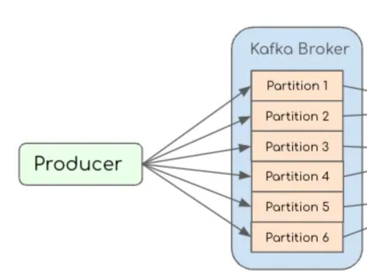
#### Metadata Discovery: How Producer Knows Where to Write

Before sending any messages, the producer must discover cluster metadata from the coordinator service (as described in the Coordinator section above):

```go
type ClusterMetadata struct {
    Brokers     map[BrokerID]*BrokerInfo     `json:"brokers"`
    Topics      map[string]*TopicMetadata    `json:"topics"`
    Partitions  map[PartitionKey]*PartitionInfo `json:"partitions"`
    UpdatedAt   time.Time                    `json:"updated_at"`
}

type BrokerInfo struct {
    ID       BrokerID     `json:"id"`
    Host     string       `json:"host"`
    Port     int          `json:"port"`
    Load     BrokerLoad   `json:"load"`        // Current load metrics
    Status   BrokerStatus `json:"status"`      // Online/Offline/Draining
    LastSeen time.Time    `json:"last_seen"`
}

type BrokerLoad struct {
    CPUUsage    float64 `json:"cpu_usage"`     // 0.0 - 1.0
    MemoryUsage float64 `json:"memory_usage"`  // 0.0 - 1.0
    DiskUsage   float64 `json:"disk_usage"`    // 0.0 - 1.0
    NetworkIO   int64   `json:"network_io"`    // bytes/sec
    MessageRate int64   `json:"message_rate"`  // messages/sec
}

// Producer fetches metadata from coordinator before sending
func (p *Producer) getClusterMetadata() (*ClusterMetadata, error) {
    // 1. Contact coordinator to get current cluster state
    resp, err := http.Get("http://coordinator:8080/api/metadata")
    if err != nil {
        return nil, fmt.Errorf("failed to fetch metadata: %w", err)
    }
    defer resp.Body.Close()
    
    var metadata ClusterMetadata
    if err := json.NewDecoder(resp.Body).Decode(&metadata); err != nil {
        return nil, fmt.Errorf("failed to parse metadata: %w", err)
    }
    
    return &metadata, nil
}

// Producer discovers which broker leads each partition
func (p *Producer) getTopicMetadata(topic string) (*TopicMetadata, error) {
    metadata, err := p.getClusterMetadata()
    if err != nil {
        return nil, err
    }
    
    topicMeta, exists := metadata.Topics[topic]
    if !exists {
        return nil, fmt.Errorf("topic %s not found", topic)
    }
    
    // Update partition leader information
    for partitionID, partition := range topicMeta.Partitions {
        if brokerInfo, exists := metadata.Brokers[partition.Leader]; exists {
            partition.LeaderEndpoint = fmt.Sprintf("%s:%d", brokerInfo.Host, brokerInfo.Port)
            partition.LeaderLoad = brokerInfo.Load
        }
    }
    
    return topicMeta, nil
}
```

#### Load Balancing and Metadata Management

The coordinator tracks broker load and helps producers make intelligent decisions. This process involves both selecting optimal partitions and efficiently managing metadata:

**Partition Selection Strategies:**

Producers use different algorithms to distribute messages across partitions. Each strategy serves specific use cases:

###### 1. Round-Robin Partitioning

**Algorithm:** Distributes messages evenly across all partitions using a rotating counter.

**Description:**
- Simple sequential distribution across partitions
- Excellent for load balancing when message ordering isn't critical
- No hot partitions - traffic spreads uniformly

**Code:**
```go
type RoundRobinPartitioner struct {
    counter int32
}

func (r *RoundRobinPartitioner) Partition(message *Message, metadata *TopicMetadata) int32 {
    partitionCount := metadata.PartitionCount
    partition := atomic.AddInt32(&r.counter, 1) % partitionCount
    return partition
}
```

###### 2. Key-Based Partitioning (Consistent Hashing)

**Algorithm:** Uses message key hash to determine partition, ensuring same keys always go to same partition.

**Description:**
- Guarantees ordering within each key
- Enables related messages to stay together
- Risk of hot partitions if key distribution is uneven

**Code:**
```go
type KeyPartitioner struct{}

func (k *KeyPartitioner) Partition(message *Message, metadata *TopicMetadata) int32 {
    if message.Key == nil {
        return rand.Int31n(metadata.PartitionCount)
    }
    
    hash := murmur3.Sum32(message.Key)
    return int32(hash % uint32(metadata.PartitionCount))
}
```

###### 3. Sticky Partitioning

**Algorithm:** Batches keyless messages to same partition until batch is full, then switches.

**Description:**
- Improves batching efficiency for better throughput
- Reduces network round-trips
- Better resource utilization while maintaining load balance

**Code:**
```go
type StickyPartitioner struct {
    stickyPartition int32
    batchIsFull     bool
    mutex           sync.Mutex
}

func (s *StickyPartitioner) Partition(message *Message, metadata *TopicMetadata) int32 {
    s.mutex.Lock()
    defer s.mutex.Unlock()
    
    if message.Key != nil {
        hash := murmur3.Sum32(message.Key)
        return int32(hash % uint32(metadata.PartitionCount))
    }
    
    if s.stickyPartition == -1 || s.batchIsFull {
        s.stickyPartition = rand.Int31n(metadata.PartitionCount)
        s.batchIsFull = false
    }
    
    return s.stickyPartition
}
```

###### 4. Load-Aware Selection

**Algorithm:** Chooses partition based on real-time broker load metrics.

**Description:**
- Monitors CPU, memory, disk usage, and message rates
- Calculates weighted scores for optimal distribution
- Prevents overloading busy brokers

**Code:**
```go
func (p *Producer) loadAwarePartitionSelection(topicMeta *TopicMetadata) int32 {
    type PartitionScore struct {
        ID    int32
        Score float64  // Lower is better
    }
    
    var scores []PartitionScore
    
    for partitionID, partition := range topicMeta.Partitions {
        load := partition.LeaderLoad
        score := (load.CPUUsage * 0.4) + 
                 (load.MemoryUsage * 0.3) + 
                 (load.DiskUsage * 0.2) + 
                 (float64(load.MessageRate) / 10000.0 * 0.1)
        
        scores = append(scores, PartitionScore{
            ID:    partitionID,
            Score: score,
        })
    }
    
    sort.Slice(scores, func(i, j int) bool {
        return scores[i].Score < scores[j].Score
    })
    
    return scores[0].ID
}
```

**Metadata Caching for Performance:**

```go
type Producer struct {
    clientID         string
    coordinatorURL   string
    metadataCache    *ClusterMetadata
    metadataExpiry   time.Time
    metadataRefreshInterval time.Duration
    // ... other fields
}

func (p *Producer) getMetadataWithCache(topic string) (*TopicMetadata, error) {
    // Check if cached metadata is still valid
    if p.metadataCache != nil && time.Now().Before(p.metadataExpiry) {
        if topicMeta, exists := p.metadataCache.Topics[topic]; exists {
            return topicMeta, nil
        }
    }
    
    // Fetch fresh metadata from coordinator
    metadata, err := p.getClusterMetadata()
    if err != nil {
        return nil, err
    }
    
    // Update cache
    p.metadataCache = metadata
    p.metadataExpiry = time.Now().Add(p.metadataRefreshInterval)
    
    topicMeta, exists := metadata.Topics[topic]
    if !exists {
        return nil, fmt.Errorf("topic %s not found", topic)
    }
    
    return topicMeta, nil
}
```

**Key Points:**
- **Producer asks coordinator** for cluster metadata (topics, partitions, broker locations and load)
- **Load balancing** happens only for keyless messages (keyed messages must go to specific partition)
- **Metadata is cached** to avoid hitting coordinator on every message
- **Fresh metadata** is fetched when cache expires or on errors
- **Smart partition selection** based on broker load metrics (CPU, memory, disk, message rate)

**For more information about load balancing challenges and solutions in Apache Kafka, see:** [How We Solve Load Balancing Challenges in Apache Kafka](https://medium.com/agoda-engineering/how-we-solve-load-balancing-challenges-in-apache-kafka-8cd88fdad02b)


### Message Batching System

Batching is one of the most critical optimizations in Kafka's architecture. Instead of sending each message individually (which would create enormous network overhead), producers collect multiple messages into batches before transmission.

**Why Batching is Essential:**

Modern applications can generate thousands of messages per second. Without batching, each message would require a separate network round-trip, overwhelming both the network and the broker with connection overhead. A single network request can have 1-2ms latency, so sending 1000 individual messages would take 1-2 seconds just in network overhead!

**The Batching Trade-off:**

Batching creates a fundamental trade-off between **latency** and **throughput**:
- **Higher batch sizes** = Better throughput, but higher latency (messages wait longer)
- **Smaller batch sizes** = Lower latency, but reduced throughput
- **Linger time** = How long to wait for a batch to fill up before sending

**Real-World Impact:**
- **Without batching**: 1,000 messages = 1,000 network requests = ~1-2 seconds
- **With batching**: 1,000 messages = 10 batches = ~10-20ms + processing time

**Our Implementation:**

```go
type MessageBatcher struct {
    maxBatchSize  int           // Maximum messages per batch
    maxBatchBytes int           // Maximum bytes per batch
    lingerTime    time.Duration // How long to wait for batch to fill
    batches       map[int32]*PartitionBatch
    flushChan     chan int32
    mutex         sync.Mutex
}

type PartitionBatch struct {
    partition     int32
    messages      []Message
    totalBytes    int
    createdAt     time.Time
    flushTimer    *time.Timer
}

func (b *MessageBatcher) Add(message Message) bool {
    b.mutex.Lock()
    defer b.mutex.Unlock()
    
    partition := message.Partition
    batch := b.batches[partition]
    
    if batch == nil {
        batch = &PartitionBatch{
            partition:  partition,
            messages:   make([]Message, 0, b.maxBatchSize),
            createdAt:  time.Now(),
        }
        b.batches[partition] = batch
        
        // Set timer for batch flush
        batch.flushTimer = time.AfterFunc(b.lingerTime, func() {
            b.flushChan <- partition
        })
    }
    
    // Add message to batch
    batch.messages = append(batch.messages, message)
    batch.totalBytes += len(message.Key) + len(message.Value)
    
    // Check if batch should be flushed
    shouldFlush := len(batch.messages) >= b.maxBatchSize || 
                   batch.totalBytes >= b.maxBatchBytes
    
    if shouldFlush {
        batch.flushTimer.Stop()
        return true // Signal caller to flush
    }
    
    return false
}

func (b *MessageBatcher) Flush() []Message {
    b.mutex.Lock()
    defer b.mutex.Unlock()
    
    var allMessages []Message
    for partition, batch := range b.batches {
        if batch.flushTimer != nil {
            batch.flushTimer.Stop()
        }
        allMessages = append(allMessages, batch.messages...)
        delete(b.batches, partition)
    }
    
    return allMessages
}
```

### Delivery Semantics

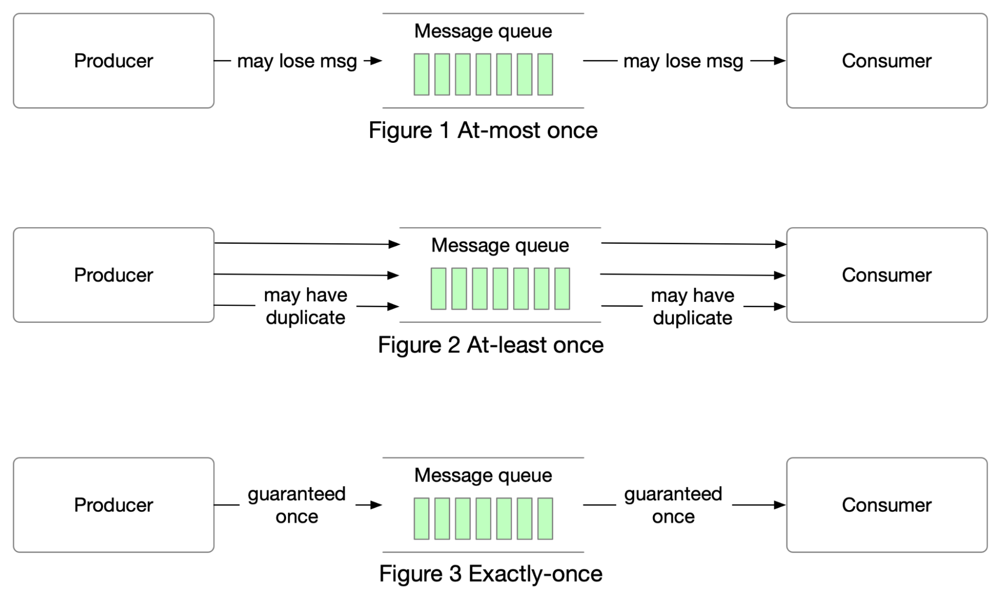

Message delivery semantics define the guarantees about message delivery between producers and consumers. Our system supports three different levels of delivery guarantees, each with different performance and reliability trade-offs:

**How Each Delivery Semantic Works in Our System:**

#### 1. At-Most-Once Delivery
- **Producer**: Uses `NoAck` - fires messages and doesn't wait for confirmation
- **Consumer**: Commits offset **before** processing the message
- **Outcome**: Fast performance, but messages can be lost if consumer crashes after commit but before processing
- **Use case**: Non-critical data like metrics or logs where occasional loss is acceptable

#### 2. At-Least-Once Delivery
- **Producer**: Uses `LeaderAck` or `AllAck` - waits for broker confirmation before considering send successful
- **Consumer**: Commits offset **after** successfully processing the message
- **Outcome**: No message loss, but duplicates possible if consumer crashes after processing but before commit
- **Use case**: Most common pattern for business-critical data

#### 3. Exactly-Once Delivery
- **Producer**: Uses transactional writes with idempotent producers
- **Consumer**: Uses transactional reads with coordinated commits
- **Outcome**: Expensive but guarantees no loss and no duplicates
- **Use case**: Financial transactions, critical business events

**Our Implementation:**

```go
type DeliverySemantics int

const (
    AtMostOnce DeliverySemantics = iota  // May lose messages, no duplicates
    AtLeastOnce                          // No message loss, possible duplicates  
    ExactlyOnce                          // No loss, no duplicates (expensive)
)

type AckLevel int

const (
    NoAck     AckLevel = 0  // Fire and forget
    LeaderAck AckLevel = 1  // Wait for leader acknowledgment
    AllAck    AckLevel = -1 // Wait for all in-sync replicas
)

func (p *Producer) sendWithAcks(messages []Message, ackLevel AckLevel) error {
    switch ackLevel {
    case NoAck:
        // Fire and forget - fastest but least reliable
        return p.sendAsync(messages)
        
    case LeaderAck:
        // Wait for leader acknowledgment - balanced approach
        return p.sendSyncToLeader(messages)
        
    case AllAck:
        // Wait for all ISR replicas - strongest guarantee
        return p.sendSyncToAll(messages)
    }
    return nil
}
```

**For More Detailed Information:**

For a deeper dive into exactly-once semantics and how Apache Kafka implements these delivery guarantees in production, read: [Exactly-once Semantics are Possible: Here's How Apache Kafka Does it](https://www.confluent.io/blog/exactly-once-semantics-are-possible-heres-how-apache-kafka-does-it/)

## The Log: Foundation of Event Streaming

**TLDR**: A log is an ordered stream of events over time. An event occurs, gets to the end of the log, and remains there unchanged.

Apache Kafka manages logs and organizes a platform that connects data providers with consumers and provides the ability to receive an ordered stream of events in real time.

### How Kafka Logs Are Structured

At its core, Kafka is built around the concept of logs - not application logs for debugging, but commit logs similar to those used in databases. Each log is an ordered, immutable sequence of records that is continually appended to.

**Physical File Structure:**

Kafka organizes data on disk in a hierarchical structure:

```
/kafka-logs/
├── topic-name-partition-0/         # Partition 0 of "topic-name"
│   ├── 00000000000000000000.log    # Segment file (data)
│   ├── 00000000000000000000.index  # Offset index
│   ├── 00000000000000000000.timeindex # Time index
│   ├── 00000000000000012345.log    # Next segment file
│   ├── 00000000000000012345.index  # Next offset index
│   └── leader-epoch-checkpoint     # Leader epoch data
├── topic-name-partition-1/          # Partition 1 of "topic-name"
│   ├── 00000000000000000000.log
│   ├── 00000000000000000000.index
│   └── ...
├── another-topic-partition-0/       # Different topic, partition 0
│   ├── 00000000000000000000.log
│   └── ...
└── __consumer_offsets-0/  # Internal Kafka topic for offset storage
    ├── 00000000000000000000.log
    └── ...
```

**Segment Files Explained:**

Each partition is divided into segments. A segment is simply a file on disk containing a portion of the log. When a segment reaches a certain size (default 1GB) or age (default 7 days), it's closed and a new segment is created.

- **Log files (.log)**: Contain the actual message data
  - Store messages in binary format with headers, keys, values, and metadata
  - Messages are appended sequentially (append-only log structure)
  - Each message has a fixed-size header followed by variable-length payload
  - Optimized for sequential I/O operations for maximum throughput
  - Cannot be modified once written (immutable log segments)

- **Index files (.index)**: Map offsets to physical positions in log files for fast lookups
  - Sparse index containing offset-to-position mappings every N messages
  - Enables O(log n) binary search to find message by offset
  - Much smaller than log files (only stores position pointers)
  - Memory-mapped for ultra-fast random access
  - Essential for consumer seek operations and random offset queries

- **Time index files (.timeindex)**: Map timestamps to offsets for time-based queries
  - Maps timestamp ranges to their corresponding offset ranges
  - Enables time-based message retrieval ("give me messages from 2 hours ago")
  - Supports retention policies based on message age
  - Used by consumers with timestamp-based seek operations
  - Critical for log compaction and cleanup operations

**Log Segment Naming Convention:**

The segment files are named with the base offset of the first message in that segment:
- `00000000000000000000.log` - Contains messages from offset 0
- `00000000000000012345.log` - Contains messages starting from offset 12,345

**Log Compaction and Retention:**

Kafka can manage log data in two ways:

1. **Time-based retention**: Delete segments older than a configured time (e.g., 7 days)
2. **Size-based retention**: Delete oldest segments when total size exceeds limit
3. **Log compaction**: Keep only the latest value for each key (for topics with keys)

**How Reads and Writes Work:**
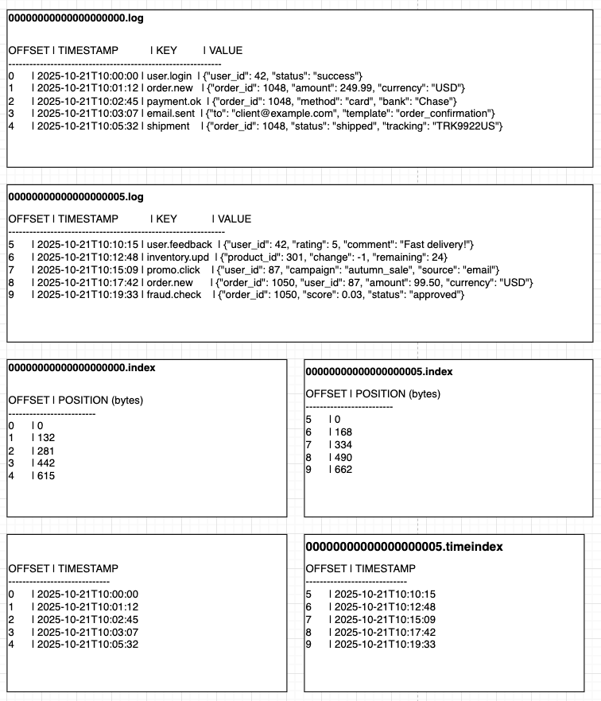

*Note: The image above shows a simplified "human-readable" example for illustration purposes. In reality, Kafka stores messages in optimized binary format with fixed-size headers, checksums, and compressed payloads for maximum performance and storage efficiency.*

**Writing (Appending):**
- New messages are always appended to the active segment (latest .log file)
- Write operations are sequential, making them very fast
- Each message gets assigned the next available offset
- **Simultaneously updates multiple files:**
  - **Log file (.log)**: Appends the actual message data in binary format
  - **Index file (.index)**: Adds offset-to-position mapping every ~4KB of data
  - **Time index (.timeindex)**: Records timestamp-to-offset mapping for time-based queries

**Reading:**
- Consumers specify an offset to start reading from
- Kafka uses the index files to quickly locate the physical position
- Reads can happen from any point in the log, multiple times

**Log Segments in Action:**

```go
type LogSegment struct {
    BaseOffset    int64           // First offset in this segment
    NextOffset    int64           // Next offset to be assigned
    LogFile       *os.File        // The .log file
    IndexFile     *os.File        // The .index file
    TimeIndexFile *os.File        // The .timeindex file
    MaxSize       int64           // When to roll to new segment
    CreatedTime   time.Time       // When this segment was created
}

// When writing a new message
func (s *LogSegment) Append(message []byte) (offset int64, err error) {
    offset = s.NextOffset
    
    // Write to log file
    position, err := s.LogFile.Write(message)
    if err != nil {
        return 0, err
    }
    
    // Update index (offset -> file position mapping)
    s.IndexFile.Write(encodeIndex(offset, position))
    
    s.NextOffset++
    return offset, nil
}
```

**Real-World Example: 10 Log Segments**

Here's how a busy topic with 10 segments would look on disk:

```
/kafka-logs/topic-orders-partition-0/
# Log files (.log) - contain actual message data
├── 00000000000000000000.log      # Messages 0-9,999
├── 00000000000000010000.log      # Messages 10,000-19,999
├── 00000000000000020000.log      # Messages 20,000-29,999
├── 00000000000000030000.log      # Messages 30,000-39,999
├── 00000000000000040000.log      # Messages 40,000-49,999
├── 00000000000000050000.log      # Messages 50,000-59,999
├── 00000000000000060000.log      # Messages 60,000-69,999
├── 00000000000000070000.log      # Messages 70,000-79,999
├── 00000000000000080000.log      # Messages 80,000-89,999
├── 00000000000000090000.log      # Messages 90,000-99,999 (active segment)
#
# Index files (.index) - map offsets to positions in log files
├── 00000000000000000000.index    # Index for segment 0
├── 00000000000000010000.index    # Index for segment 1
├── 00000000000000020000.index    # Index for segment 2
├── 00000000000000030000.index    # Index for segment 3
├── 00000000000000040000.index    # Index for segment 4
├── 00000000000000050000.index    # Index for segment 5
├── 00000000000000060000.index    # Index for segment 6
├── 00000000000000070000.index    # Index for segment 7
├── 00000000000000080000.index    # Index for segment 8
└── 00000000000000090000.index    # Index for segment 9 (active)
```

**Reading Process Example:**

**How Reading by Offset Works:**

**Step 1: Find Correct Segment (Binary Search)**
- Kafka maintains sorted list of segment base offsets: [0, 10000, 20000, 30000, ...]
- For target offset 65,432: Binary search finds segment starting at 60,000
- Load corresponding files: `00000000000000060000.log` and `00000000000000060000.index`

**Step 2: Find Position in Segment (Binary Search)**
- Use sparse index to locate approximate position
- Index entries: [(60000→0), (64000→4096), (68000→8192)]
- For offset 65,432: Binary search finds entry (64000→4096)
- Start reading from byte position 4096 in log file

**Step 3: Sequential Scan to Exact Offset**
- Read messages sequentially from position 4096
- Check each message offset until reaching 65,432
- Return batch of messages starting from that exact offset

**How Reading by Timestamp Works:**

**Step 1: Find Time Range (Binary Search)**
- Use time index to map timestamp to offset range
- Time entries: [(timestamp1→offset1), (timestamp2→offset2)]
- Binary search finds closest timestamp ≤ target timestamp

**Step 2: Convert to Offset-Based Search**
- Get offset from time index result
- Switch to standard offset-based lookup process
- Continue with binary search through segments and positions

**1. Log File Format Implementation:**
```go
type LogFileEntry struct {
    Offset      int64             // 8 bytes
    MessageSize uint32            // 4 bytes
    CRC32       uint32            // 4 bytes
    Magic       byte              // 1 byte
    Attributes  byte              // 1 byte
    Timestamp   int64             // 8 bytes
    KeyLength   int32             // 4 bytes
    Key         []byte            // Variable
    ValueLength int32             // 4 bytes
    Value       []byte            // Variable
    Headers     []MessageHeader   // Variable
}

func (l *LogFile) writeMessage(msg *Message) (int64, error) {
    messageSize := 26 + len(msg.Key) + len(msg.Value)
    buffer := make([]byte, 0, messageSize+12)
    
    binary.BigEndian.PutUint64(buffer[0:8], uint64(msg.Offset))
    binary.BigEndian.PutUint32(buffer[8:12], uint32(messageSize))
    
    pos := 12
    binary.BigEndian.PutUint32(buffer[pos:pos+4], msg.CRC32)
    buffer[pos+4] = msg.Magic
    buffer[pos+5] = msg.Attributes
    binary.BigEndian.PutUint64(buffer[pos+6:pos+14], uint64(msg.Timestamp))
    
    binary.BigEndian.PutUint32(buffer[pos+14:pos+18], int32(len(msg.Key)))
    copy(buffer[pos+18:], msg.Key)
    binary.BigEndian.PutUint32(buffer[pos+18+len(msg.Key):], int32(len(msg.Value)))
    copy(buffer[pos+22+len(msg.Key):], msg.Value)
    
    return l.file.Write(buffer)
}
```

**2. Index File Binary Search Implementation:**
```go
type IndexEntry struct {
    RelativeOffset uint32  // Offset relative to segment base offset
    Position       uint32  // Byte position in .log file
}

type IndexFile struct {
    file        *os.File
    mmap        []byte     // Memory-mapped file for fast access
    entries     []IndexEntry
    baseOffset  int64      // Base offset of the segment
    maxEntries  int        // Maximum number of entries
}

func (idx *IndexFile) lookup(targetOffset int64) (uint32, error) {
    relativeOffset := uint32(targetOffset - idx.baseOffset)
    
    // Binary search through memory-mapped entries
    left, right := 0, len(idx.entries)-1
    
    for left <= right {
        mid := (left + right) / 2
        entry := idx.entries[mid]
        
        if entry.RelativeOffset == relativeOffset {
            return entry.Position, nil
        } else if entry.RelativeOffset < relativeOffset {
            left = mid + 1
        } else {
            right = mid - 1
        }
    }
    
    // Return largest entry <= targetOffset
    if right >= 0 {
        return idx.entries[right].Position, nil
    }
    
    return 0, nil // Read from beginning
}
```

**3. Complete Reading Process:**
```go
// Consumer wants to read from offset 65,432
func (p *Partition) ReadFromOffset(targetOffset int64) []Message {
    // 1. Find correct segment: offset 65,432 is in segment 060000
    segment := p.findSegment(65,432) // Returns segment starting at 60,000
    
    // 2. Use index to find position in log file
    position := segment.IndexFile.findPosition(65,432)
    
    // 3. Seek to that position and read
    segment.LogFile.Seek(position, 0)
    return segment.readMessages(100) // Read next 100 messages
}
```

**Benefits of This Log Structure:**

1. **Sequential I/O**: All writes are appends, which are much faster than random writes
2. **Immutability**: Once written, messages never change, simplifying concurrent access
3. **Efficient Storage**: Index files allow fast random access without loading entire log
4. **Scalability**: Each partition can be on different disks/servers
5. **Fault Tolerance**: Segments can be replicated across multiple brokers


### Internal File Structure Details

Now let's dive deeper into how each file type stores data internally:

#### 1. Log Files (.log) - Message Data Storage

The .log files contain the actual message data in a binary format. Each message is stored with the following structure:

```
Message Record Format:
┌─────────────┬──────────────┬─────────────┬──────────────┬─────────────┬─────────────┐
│   Offset    │  Message     │   CRC32     │  Magic Byte  │  Attributes │  Timestamp  │
│   8 bytes   │  Size        │   4 bytes   │   1 byte     │   1 byte    │   8 bytes   │
│   (int64)   │  4 bytes     │             │              │             │             │
└─────────────┼──────────────┼─────────────┼──────────────┼─────────────┼─────────────┤
│  Key Length │  Key Data    │ Value Length│  Value Data  │   Headers   │             │
│   4 bytes   │  N bytes     │   4 bytes   │   M bytes    │  Variable   │             │
│   (int32)   │              │   (int32)   │              │             │             │
└─────────────┴──────────────┴─────────────┴──────────────┴─────────────┴─────────────┘
```

**Log File Components:**
- **Offset**: Unique monotonic identifier for the message within partition
- **Message Size**: Total size of the message record in bytes
- **CRC32**: Checksum for data integrity verification
- **Magic Byte**: Protocol version identifier (v0, v1, v2)
- **Attributes**: Compression type, timestamp type flags
- **Timestamp**: Message timestamp (producer or broker time)
- **Key/Value**: Actual message payload

#### 2. Index Files (.index) - Offset to Position Mapping

Index files provide fast lookup from logical offsets to physical byte positions in the log file. They use a compact binary format:

```
Index Entry Format (8 bytes each):
┌──────────────┬─────────────────┐
│ Relative     │ Physical        │
│ Offset       │ Position        │
│ 4 bytes      │ 4 bytes         │
│ (int32)      │ (int32)         │
└──────────────┴─────────────────┘
```

**Index File Details:**
- **Sparse indexing**: Not every message has an index entry (default: every 4KB of log data)
- **Relative offsets**: Stored relative to segment base offset to save space
- **Sorted order**: Entries are always sorted by offset for binary search
- **Fixed size**: Each entry is exactly 8 bytes

#### 3. Time Index Files (.timeindex) - Timestamp to Offset Mapping

Time index files enable time-based queries by mapping timestamps to offsets:

```
Time Index Entry Format (12 bytes each):
┌──────────────┬──────────────┬─────────────────┐
│ Timestamp    │ Relative     │ (Padding)       │
│ 8 bytes      │ Offset       │ 0 bytes         │
│ (int64)      │ 4 bytes      │                 │
│              │ (int32)      │                 │
└──────────────┴──────────────┴─────────────────┘
```

**Time Index Details:**
- **Timestamp precision**: Milliseconds since Unix epoch
- **Sparse entries**: Not every message, typically every segment boundary
- **Monotonic timestamps**: Entries must be in chronological order
- **Time-based queries**: Enable "read from timestamp X" operations
### Message Write Flow: From Producer to Log

Here's the complete flow of how a message travels from producer to being stored in log files:

```go
// Complete message write flow
func (broker *Broker) handleProduceRequest(req *ProduceRequest) error {
    for _, batch := range req.MessageBatches {
        // Step 1: Validate and assign offsets
        partition := broker.getPartition(batch.Topic, batch.Partition)
        if partition == nil {
            return fmt.Errorf("partition not found")
        }
        
        // Step 2: Assign consecutive offsets
        startOffset := partition.nextOffset
        for i, msg := range batch.Messages {
            msg.Offset = startOffset + int64(i)
            msg.Timestamp = time.Now().UnixMilli()
        }
        
        // Step 3: Write to active log segment
        err := broker.writeToLog(partition, batch.Messages)
        if err != nil {
            return fmt.Errorf("failed to write to log: %w", err)
        }
        
        // Step 4: Update indexes
        err = broker.updateIndexes(partition, batch.Messages)
        if err != nil {
            return fmt.Errorf("failed to update indexes: %w", err)
        }
        
        // Step 5: Update high water mark
        partition.highWaterMark = batch.Messages[len(batch.Messages)-1].Offset + 1
        
        // Step 6: Trigger replication (if leader)
        if partition.isLeader {
            go broker.replicateToFollowers(partition, batch.Messages)
        }
        
        // Step 7: Send acknowledgment back to producer
        go broker.sendProduceResponse(req.ClientID, batch.Messages)
    }
    
    return nil
}

func (broker *Broker) writeToLog(partition *Partition, messages []*Message) error {
    activeSegment := partition.activeSegment
    
    // Check if we need to roll to new segment
    if activeSegment.shouldRoll() {
        newSegment, err := partition.rollNewSegment()
        if err != nil {
            return err
        }
        activeSegment = newSegment
    }
    
    // Write each message to log file
    for _, msg := range messages {
        // Step 1: Serialize message
        data, err := msg.serialize()
        if err != nil {
            return err
        }
        
        // Step 2: Calculate CRC32 for integrity
        msg.CRC32 = crc32.ChecksumIEEE(data)
        
        // Step 3: Write to log file
        position, err := activeSegment.logFile.writeMessage(msg)
        if err != nil {
            return err
        }
        
        // Step 4: Update segment metadata
        activeSegment.size += int64(len(data))
        activeSegment.messageCount++
        activeSegment.lastOffset = msg.Offset
        
        log.Printf("Written message offset=%d, size=%d bytes, position=%d", 
            msg.Offset, len(data), position)
    }
    
    return nil
}

func (broker *Broker) updateIndexes(partition *Partition, messages []*Message) error {
    activeSegment := partition.activeSegment
    
    for _, msg := range messages {
        // Update offset index (sparse - every 4KB or configurable interval)
        if broker.shouldCreateIndexEntry(activeSegment, msg) {
            err := activeSegment.offsetIndex.append(msg.Offset, msg.Position)
            if err != nil {
                return fmt.Errorf("failed to update offset index: %w", err)
            }
        }
        
        // Update time index (even more sparse - every segment or time interval)
        if broker.shouldCreateTimeIndexEntry(activeSegment, msg) {
            err := activeSegment.timeIndex.append(msg.Timestamp, msg.Offset)
            if err != nil {
                return fmt.Errorf("failed to update time index: %w", err)
            }
        }
    }
    
    return nil
}

func (broker *Broker) shouldCreateIndexEntry(segment *LogSegment, msg *Message) bool {
    // Create index entry every 4KB of log data (configurable)
    return (segment.size - segment.lastIndexedPosition) >= 4096
}

func (broker *Broker) shouldCreateTimeIndexEntry(segment *LogSegment, msg *Message) bool {
    // Create time index entry every 10 minutes or 1MB (configurable)
    timeDiff := msg.Timestamp - segment.lastIndexedTimestamp
    sizeDiff := segment.size - segment.lastTimeIndexedPosition
    
    return timeDiff >= 600000 || sizeDiff >= 1048576 // 10 minutes or 1MB
}

// Complete write flow example
func ExampleMessageWriteFlow() {
    // Producer sends batch of messages
    messages := []*Message{
        {Key: []byte("user-123"), Value: []byte(`{"action": "login"}`)},
        {Key: []byte("user-456"), Value: []byte(`{"action": "logout"}`)},
        {Key: []byte("user-789"), Value: []byte(`{"action": "purchase"}`)},
    }
    
    // Broker processes the batch
    for _, msg := range messages {
        log.Printf("Processing message: key=%s", string(msg.Key))
        
        // 1. Assign offset: 15000, 15001, 15002
        // 2. Write to log: append to 00000000000000012345.log
        // 3. Update index: add entry to 00000000000000012345.index
        // 4. Update time index: maybe add to 00000000000000012345.timeindex
        // 5. Sync to followers: replicate to other brokers
        // 6. Send ack: confirm write to producer
    }
    
    // Result: 3 messages persisted durably to disk with indexes for fast retrieval
}
```

**Write Flow Summary:**
1. **Message Reception**: Broker receives batch from producer
2. **Offset Assignment**: Each message gets unique, monotonic offset
3. **Log Writing**: Messages appended to active segment's .log file
4. **Index Updates**: Sparse entries added to .index and .timeindex files
5. **Metadata Update**: Partition high water mark advanced
6. **Replication**: Data copied to follower replicas (if leader)
7. **Acknowledgment**: Success response sent back to producer

This flow ensures durability, ordering, and efficient retrieval while maintaining high write throughput.

**Further Reading**: For more detailed information about Kafka log performance and internals, see [Kafka Performance: Kafka Logs](https://www.redpanda.com/guides/kafka-performance-kafka-logs).

### Consumer Service

The consumer pulls messages from topics and manages offset tracking:

```go
type Consumer struct {
    groupID     string
    topics      []string
    assignment  map[string][]int32 // topic -> partitions
    offsets     map[TopicPartition]int64
    coordinator *GroupCoordinator
    fetcher     *MessageFetcher
    processor   MessageProcessor
    config      ConsumerConfig
}

type ConsumerConfig struct {
    GroupID              string        `yaml:"group_id"`
    Topics               []string      `yaml:"topics"`
    AutoOffsetReset      OffsetReset   `yaml:"auto_offset_reset"`
    EnableAutoCommit     bool          `yaml:"enable_auto_commit"`
    AutoCommitInterval   time.Duration `yaml:"auto_commit_interval"`
    SessionTimeout       time.Duration `yaml:"session_timeout"`
    HeartbeatInterval    time.Duration `yaml:"heartbeat_interval"`
    MaxPollRecords       int           `yaml:"max_poll_records"`
    FetchMinBytes        int           `yaml:"fetch_min_bytes"`
    FetchMaxWait         time.Duration `yaml:"fetch_max_wait"`
}

type TopicPartition struct {
    Topic     string `json:"topic"`
    Partition int32  `json:"partition"`
}

### Consumer Design and Operation

A typical consumer program works like this: when starting, a timer works inside it, which periodically polls new records from broker partitions. The poller receives a list of batches related to topics and partitions from which the consumer reads. Next, the received messages in batches are deserialized. As a result, the consumer, as a rule, somehow processes the messages.

At the end of reading, the consumer can commit the offset - remember the position of read records and continue reading the new portion of data. You can read both synchronously and asynchronously. The offset can be committed or not committed at all.

Thus, if the consumer read a message from a partition, processed it, and then crashed without committing the offset, then the next connected consumer on the next connection will read the same portion of data again.

The main thing is that the consumer periodically reads a new portion of data, deserializes it, and then processes it.

```go
// Consumer workflow implementation
func (c *Consumer) Start() error {
    // Start heartbeat routine for group coordination
    go c.sendHeartbeats()
    
    // Start offset commit routine if auto-commit enabled
    if c.config.EnableAutoCommit {
        go c.autoCommitOffsets()
    }
    
    // Main polling loop
    for {
        messages, err := c.Poll(c.config.PollTimeout)
        if err != nil {
            log.Printf("Poll error: %v", err)
            continue
        }
        
        if len(messages) > 0 {
            err = c.processMessages(messages)
            if err != nil {
                log.Printf("Processing error: %v", err)
                continue
            }
            
            // Commit offsets after successful processing
            if !c.config.EnableAutoCommit {
                err = c.CommitSync()
                if err != nil {
                    log.Printf("Commit error: %v", err)
                }
            }
        }
    }
}

func (c *Consumer) processMessages(messages []Message) error {
    for _, msg := range messages {
        // Deserialize message
        event, err := c.deserializer.Deserialize(msg.Value)
        if err != nil {
            return fmt.Errorf("deserialization failed: %w", err)
        }
        
        // Process business logic
        err = c.processor.Process(event)
        if err != nil {
            return fmt.Errorf("message processing failed: %w", err)
        }
        
        // Update local offset tracking
        tp := TopicPartition{Topic: msg.Topic, Partition: msg.Partition}
        c.offsets[tp] = msg.Offset + 1
    }
    
    return nil
}
```

// Poll retrieves messages from assigned partitions
func (c *Consumer) Poll(timeout time.Duration) ([]Message, error) {
ctx, cancel := context.WithTimeout(context.Background(), timeout)
defer cancel()

    var allMessages []Message
    
    for topic, partitions := range c.assignment {
        for _, partition := range partitions {
            tp := TopicPartition{Topic: topic, Partition: partition}
            offset := c.offsets[tp]
            
            messages, err := c.fetcher.Fetch(ctx, tp, offset, c.config.MaxPollRecords)
            if err != nil {
                return nil, fmt.Errorf("failed to fetch from %s-%d: %w", topic, partition, err)
            }
            
            allMessages = append(allMessages, messages...)
            
            // Update offset for next poll
            if len(messages) > 0 {
                lastOffset := messages[len(messages)-1].Offset
                c.offsets[tp] = lastOffset + 1
            }
        }
    }
    
    return allMessages, nil
}

// Commit offsets for processed messages
func (c *Consumer) CommitSync() error {
return c.coordinator.CommitOffsets(c.groupID, c.offsets)
}

func (c *Consumer) CommitAsync() {
go func() {
if err := c.CommitSync(); err != nil {
log.Printf("Failed to commit offsets: %v", err)
}
}()
}
```

### Consumer Groups

It would be strange if only one consumer was engaged in reading all partitions. They can be combined into a cluster - consumer groups.

You have before your eyes a canonical diagram: on the left side are producers, in the middle are topics, and on the right are consumers. There are two producers, each writing to its own topic, each topic has three partitions.

There is one consumer group with two instances of the same program - this is the same program, running twice. This consumer program reads two topics: X and Y.

The consumer connects to the broker with the leader partition, polls changes in the partition, reads messages, fills the buffer, and then processes the received messages.

Note that the partitions are distributed cooperatively: each consumer got three partitions. The distribution of partitions between consumers within one group is performed automatically on the broker side. Kafka tries to fairly distribute partitions between consumer groups, as much as possible.

Each such group has its own identifier, which allows registering on Kafka brokers. The namespace of consumer groups is global, which means their names in the Kafka cluster are unique.

Finally, the most important thing: Kafka saves on its side the current offset for each partition of topics that are part of the consumer group. When connecting or disconnecting consumers from the group, reading will continue from the last saved position. This makes consumer groups indispensable when working with event-driven systems: we can deploy our applications without problems and not think about storing offsets on the client side.

For this, the consumer in the group, after processing read messages, sends a request to save the offset - or commits its offset. Technically, there are no restrictions on committing the offset before processing messages, but for most scenarios it's more reasonable to do this after.

### Consumer Groups and Rebalancing

Consumer groups enable horizontal scaling of message processing:

```go
type GroupCoordinator struct {
    groups      map[string]*ConsumerGroup
    assignments map[string]map[string][]TopicPartition // groupID -> consumerID -> partitions
    offsets     map[string]map[TopicPartition]int64    // groupID -> partition -> offset
    mutex       sync.RWMutex
    rebalancer  Rebalancer
}

type ConsumerGroup struct {
    ID           string                    `json:"id"`
    Members      map[string]*GroupMember   `json:"members"`
    Leader       string                    `json:"leader"`
    Protocol     string                    `json:"protocol"`
    State        GroupState                `json:"state"`
    Generation   int32                     `json:"generation"`
}

type GroupMember struct {
    ID             string    `json:"id"`
    Host           string    `json:"host"`
    Topics         []string  `json:"topics"`
    LastHeartbeat  time.Time `json:"last_heartbeat"`
    SessionTimeout time.Duration `json:"session_timeout"`
}

type GroupState string

const (
    GroupStateStable      GroupState = "Stable"
    GroupStateRebalancing GroupState = "Rebalancing"
    GroupStateEmpty       GroupState = "Empty"
    GroupStateDead        GroupState = "Dead"
)

// JoinGroup handles new consumer joining a group
func (gc *GroupCoordinator) JoinGroup(groupID, memberID string, topics []string, sessionTimeout time.Duration) error {
    gc.mutex.Lock()
    defer gc.mutex.Unlock()
    
    group, exists := gc.groups[groupID]
    if !exists {
        group = &ConsumerGroup{
            ID:      groupID,
            Members: make(map[string]*GroupMember),
            State:   GroupStateEmpty,
        }
        gc.groups[groupID] = group
    }
    
    member := &GroupMember{
        ID:             memberID,
        Topics:         topics,
        LastHeartbeat:  time.Now(),
        SessionTimeout: sessionTimeout,
    }
    
    group.Members[memberID] = member
    
    // Trigger rebalance
    if group.State == GroupStateStable {
        group.State = GroupStateRebalancing
        go gc.rebalanceGroup(groupID)
    }
    
    return nil
}

// Rebalance redistributes partitions among group members
func (gc *GroupCoordinator) rebalanceGroup(groupID string) {
    gc.mutex.Lock()
    defer gc.mutex.Unlock()
    
    group := gc.groups[groupID]
    if group.State != GroupStateRebalancing {
        return
    }
    
    // Get all partitions for subscribed topics
    var allPartitions []TopicPartition
    topicSet := make(map[string]bool)
    
    for _, member := range group.Members {
        for _, topic := range member.Topics {
            topicSet[topic] = true
        }
    }
    
    for topic := range topicSet {
        partitions := gc.getTopicPartitions(topic)
        for _, partition := range partitions {
            allPartitions = append(allPartitions, TopicPartition{
                Topic:     topic,
                Partition: partition,
            })
        }
    }
    
    // Assign partitions using round-robin strategy
    memberIDs := make([]string, 0, len(group.Members))
    for memberID := range group.Members {
        memberIDs = append(memberIDs, memberID)
    }
    sort.Strings(memberIDs) // Ensure consistent ordering
    
    assignment := make(map[string][]TopicPartition)
    for i, partition := range allPartitions {
        memberID := memberIDs[i%len(memberIDs)]
        assignment[memberID] = append(assignment[memberID], partition)
    }
    
    gc.assignments[groupID] = assignment
    group.State = GroupStateStable
    group.Generation++
    
    log.Printf("Rebalanced group %s with %d members and %d partitions", 
               groupID, len(group.Members), len(allPartitions))
}

### Consumer Group Rebalancing Process

Let's consider a scenario when the group composition changes. In the Kafka cluster, consumer groups are created automatically when consumers connect to the cluster, and there's no need to create them manually, but this is possible through tooling. A new group has no saved offsets for topic partitions and by default they are equal to -1.

When new participants appear in the JoinGroup group, in a special broker process Group Coordinator, the first consumer to enter is assigned the role of Group Leader.

The group leader is responsible for distributing partitions among all group members. The process of finding the group leader, assigning partitions, stabilizing, and connecting consumers in the group to brokers is called consumer group rebalancing.

The group rebalancing process by default forces all consumers in the group to stop reading and wait for complete synchronization of participants to acquire new partitions for reading. Kafka has other group rebalancing strategies, including Static membership or Cooperative Incremental Partition Assignor, but this is a topic for a separate article.

```go
// Rebalancing process implementation
func (gc *GroupCoordinator) handleRebalance(groupID string, reason RebalanceReason) error {
    gc.mutex.Lock()
    defer gc.mutex.Unlock()
    
    group := gc.groups[groupID]
    if group == nil {
        return fmt.Errorf("group %s not found", groupID)
    }
    
    log.Printf("Starting rebalance for group %s, reason: %v", groupID, reason)
    
    // Step 1: Stop the world - pause all consumers
    group.State = GroupStateRebalancing
    gc.notifyGroupMembers(groupID, "REBALANCE_START")
    
    // Step 2: Wait for all members to acknowledge
    err := gc.waitForMemberAcknowledgments(groupID, 30*time.Second)
    if err != nil {
        return fmt.Errorf("rebalance timeout: %w", err)
    }
    
    // Step 3: Select group leader (first member or existing leader)
    leader := gc.selectGroupLeader(group)
    group.Leader = leader.ID
    
    // Step 4: Generate new partition assignment
    assignment := gc.generatePartitionAssignment(group)
    gc.assignments[groupID] = assignment
    
    // Step 5: Notify all members of new assignment
    for memberID, partitions := range assignment {
        member := group.Members[memberID]
        if member != nil {
            member.Assignment = partitions
            gc.notifyMemberAssignment(memberID, partitions)
        }
    }
    
    // Step 6: Group becomes stable
    group.State = GroupStateStable
    group.Generation++
    
    log.Printf("Rebalance completed for group %s, generation %d", groupID, group.Generation)
    return nil
}

type RebalanceReason int

const (
    MemberJoined RebalanceReason = iota
    MemberLeft
    MemberTimedOut
    TopicMetadataChanged
    PartitionCountChanged
)

// Heartbeat management for group coordination
func (c *Consumer) sendHeartbeats() {
    ticker := time.NewTicker(c.config.HeartbeatInterval)
    defer ticker.Stop()
    
    for {
        select {
        case <-ticker.C:
            err := c.coordinator.SendHeartbeat(c.groupID, c.memberID)
            if err != nil {
                log.Printf("Heartbeat failed: %v", err)
                // Trigger rejoin process
                go c.rejoinGroup()
                return
            }
        case <-c.quit:
            return
        }
    }
}
```

As soon as the group becomes stable, and its members receive partitions, the consumers in it begin reading. Since the group is new and didn't exist before, the consumer chooses the reading position of the offset: from the very beginning earliest or from the end latest. The topic could have existed for several months, and the consumer appeared quite recently. In this case, it's important to decide: whether to read all messages or it's enough to read from the end the most recent ones, skipping the history. The choice between the two options depends on the business logic of events flowing inside the topic.

If you add a new member to the group, the rebalancing process starts again. The new member, together with the rest of the consumers in the group, will be assigned partitions, and the group leader will try to distribute them among everyone more or less fairly, according to the configurable strategy he chose. Then the group again transitions to a stable state.

To ensure that the Group Coordinator in the Kafka cluster knows which of its members are active and working, and which are no longer, each consumer in the group regularly sends Heartbeat messages at equal intervals. The time value is configured by the consumer program before startup.

The consumer also declares the session lifetime - if during this time it couldn't send any Heartbeat messages to the broker, then it leaves the group. The broker, in turn, not receiving any Heartbeat messages from consumers, starts the process of rebalancing consumers in the group.

The rebalancing process is quite painful for large consumer groups with many topics. It causes Stop-The-World in the entire group with the slightest change in member composition or partition composition in topics. For example, when changing the partition leader in case of broker exit from the cluster due to accident or planned work, Group Coordinator also initiates rebalancing.

Therefore, developers of consumer programs are usually recommended to use one consumer group per topic. It's also useful to keep the number of consumers not too large so as not to trigger rebalancing many times, but also not too small to maintain performance and reliability when reading.

Heartbeat interval and session lifetime values should be set so that the Heartbeat interval is three to four times smaller than session timeout. The values themselves should be chosen not too large so as not to increase the time to detect a "dropped" consumer from the group, but also not too small so that in case of the slightest network problems, the group doesn't go into rebalancing.

Another hypothetical scenario: there are 4 partitions in a topic, and 5 consumers in a group. In this case, the group will be stabilized, but members who don't get any partitions will be idle. This happens because only one consumer in a group can work with one partition, and two or more consumers cannot read from one partition in a group.

This gives rise to the following basic recommendation: set a sufficient number of partitions at the start so that you can horizontally scale your application. Increasing partitions at the moment will bring you almost no result. Already written log messages cannot be moved and distributed between new partitions by Kafka means, and repartitioning on your own always carries risks associated with ordering and idempotency.
```

### Broker Service

The broker is the core storage and replication engine:

```go
type Broker struct {
    ID            BrokerID              `json:"id"`
    Host          string                `json:"host"`
    Port          int                   `json:"port"`
    Partitions    map[PartitionKey]*PartitionLog `json:"-"`
    ReplicationMgr *ReplicationManager   `json:"-"`
    Storage       StorageEngine         `json:"-"`
    Config        BrokerConfig          `json:"-"`
    mutex         sync.RWMutex
}

type PartitionKey struct {
    Topic     string `json:"topic"`
    Partition int32  `json:"partition"`
}

type PartitionLog struct {
    Key           PartitionKey    `json:"key"`
    Segments      []*LogSegment   `json:"segments"`
    ActiveSegment *LogSegment     `json:"active_segment"`
    Index         *OffsetIndex    `json:"index"`
    HighWaterMark int64           `json:"high_water_mark"`
    LogStartOffset int64          `json:"log_start_offset"`
    mutex         sync.RWMutex
}

type LogSegment struct {
    BaseOffset   int64     `json:"base_offset"`
    File         *os.File  `json:"-"`
    Size         int64     `json:"size"`
    MaxSize      int64     `json:"max_size"`
    CreatedAt    time.Time `json:"created_at"`
    MessageCount int       `json:"message_count"`
}

// Append messages to a partition
func (b *Broker) Append(key PartitionKey, messages []Message) ([]int64, error) {
    b.mutex.RLock()
    partitionLog, exists := b.Partitions[key]
    b.mutex.RUnlock()
    
    if !exists {
        return nil, fmt.Errorf("partition %s-%d not found", key.Topic, key.Partition)
    }
    
    return partitionLog.Append(messages)
}

func (pl *PartitionLog) Append(messages []Message) ([]int64, error) {
    pl.mutex.Lock()
    defer pl.mutex.Unlock()
    
    if pl.ActiveSegment == nil || pl.ActiveSegment.Size >= pl.ActiveSegment.MaxSize {
        if err := pl.rollSegment(); err != nil {
            return nil, err
        }
    }
    
    var offsets []int64
    for _, msg := range messages {
        msg.Offset = pl.HighWaterMark
        msg.Partition = pl.Key.Partition
        
        data := serializeMessage(msg)
        if err := pl.ActiveSegment.Append(data); err != nil {
            return nil, err
        }
        
        pl.Index.Add(msg.Offset, pl.ActiveSegment.Size)
        offsets = append(offsets, msg.Offset)
        pl.HighWaterMark++
    }
    
    return offsets, nil
}

// Fetch messages from a partition
func (b *Broker) Fetch(key PartitionKey, offset int64, maxBytes int) ([]Message, error) {
    b.mutex.RLock()
    partitionLog, exists := b.Partitions[key]
    b.mutex.RUnlock()
    
    if !exists {
        return nil, fmt.Errorf("partition %s-%d not found", key.Topic, key.Partition)
    }
    
    return partitionLog.Fetch(offset, maxBytes)
}

func (pl *PartitionLog) Fetch(startOffset int64, maxBytes int) ([]Message, error) {
    pl.mutex.RLock()
    defer pl.mutex.RUnlock()
    
    if startOffset < pl.LogStartOffset {
        return nil, fmt.Errorf("offset %d is before log start offset %d", startOffset, pl.LogStartOffset)
    }
    
    if startOffset >= pl.HighWaterMark {
        return []Message{}, nil // No new messages
    }
    
    // Find the segment containing the start offset
    segmentIndex := pl.Index.FindSegment(startOffset)
    if segmentIndex == -1 {
        return nil, fmt.Errorf("no segment found for offset %d", startOffset)
    }
    
    var messages []Message
    bytesRead := 0
    
    for i := segmentIndex; i < len(pl.Segments) && bytesRead < maxBytes; i++ {
        segment := pl.Segments[i]
        segmentMessages, err := segment.ReadFrom(startOffset)
        if err != nil {
            return nil, err
        }
        
        for _, msg := range segmentMessages {
            if msg.Offset >= startOffset && bytesRead < maxBytes {
                messages = append(messages, msg)
                bytesRead += len(msg.Value) + len(msg.Key) + 64 // Approximate message overhead
                startOffset = msg.Offset + 1
            }
        }
    }
    
    return messages, nil
}
```
